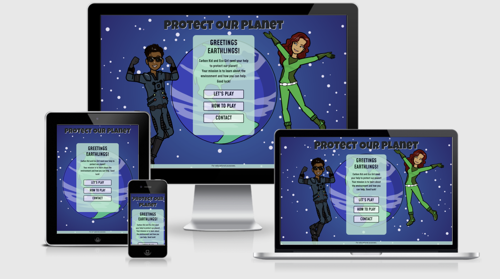

# Protect Our Planet

Protect Our Planet is an interactive quiz aimed at 8-12 year old children, with the aim of engaging positively about environmental topics in a fun way. Climate change is increasingly becoming a top priority on the social and political agenda, and it is important that our children understand how to look after the planet. This quiz aims to introduce topics such as recycling, renewable energy, water efficiency and sustainable transport in an easily digestable and fun way, with the hope of inspiring and empowering young people to take action.  

This project has been developed as the User Centric Frontend Development Milestone 2 Project as part of Code Institute's Software Development Diploma.  

Deployed website can be viewed [here](https://anyahush.github.io/protect-our-planet-quiz/).

## Table of Contents
---
1. [Project Goals](https://github.com/anyahush/protect-our-planet-quiz#project-goals)
2. [UX](https://github.com/anyahush/protect-our-planet-quiz#ux-design)
3. [Strategy Plane](https://github.com/anyahush/protect-our-planet-quiz#strategy-plane)
    * [User Stories](https://github.com/anyahush/protect-our-planet-quiz#user-stories)
4. [Scope Plane](https://github.com/anyahush/protect-our-planet-quiz#scope-plane)
    * [Existing Features](https://github.com/anyahush/protect-our-planet-quiz#existing-features)
    * [Features Left to Implement](https://github.com/anyahush/protect-our-planet-quiz#features-left-to-implement)
5. [Structure Plane](https://github.com/anyahush/protect-our-planet-quiz#structure-plane)
6. [Skeleton Plane](https://github.com/anyahush/protect-our-planet-quiz#skeleton-plane)
7. [Surface Plane](https://github.com/anyahush/protect-our-planet-quiz#surface-plane)
8. [Technologies](https://github.com/anyahush/protect-our-planet-quiz#technologies)
9. [Testing](testing.md)
10. [Deployment](https://github.com/anyahush/protect-our-planet-quiz#deployment)
11. [Credits](https://github.com/anyahush/protect-our-planet-quiz#credits)
12. [Acknowledgements](https://github.com/anyahush/protect-our-planet-quiz#acknowledegments)

---

## Project Goals

* To engage with children in an intereactive quiz on environmental topics
* To teach children about climate change
* To inspire and empower children to take action against climate change
* To act as an educational resource for parents, carers, teachers etc.

## UX Design

## Strategy Plane

### Site Owner Goals
* For children and players to have fun
* For children and players to learn about climate change
* For players and/ or parents etc. to leave feedback and/ or get in touch
* To engage with parents etc. in conversation about the environment and open up dialogue

### User Stories

First-time visitor:
* As a first-time visior, I want to be able to understand the purpose of the site easily.

Players:
* As a player, I want to take part in an interactive quiz, so I can have fun.
* As a player, I want to take part in the quiz, so I can learn about the environment.
* As a player, I want to be able to progress through levels, so I can continue to playing and test what I know.
* As a player, I want to be able to see how many questions are left.
* As a player, I want to see my score, so I can see how well I am doing and where I can improve.
* As a player, I want to be able to exit the game at any point.
* As a player, I want to be able to understand the aim of the game and rules easily. 
* As a player, I want to be able to navigate the site easily.
* As a player, I want to enjoy content on different devices.
* As a player, I want to enjoy a vibrant and eye-catching theme and design.

Parents, Teachers etc. :
* As a parent/teacher, I want the game to teach children about the environment in a fun and accessible way, so they can understand.
* As a parent/teacher, I want to be able to contact the site owner, so I can have my queries resolved. 

### Opportunity Goal Table

During the initial strategy planning, the opportunities of the site were determined and values were given according to their imporance and viability at this stage.

| Opportunity | Importance | Viability |
| ----------- | ---------- | --------- |
| 1. Create an interactive quiz | 5 | 5 |
| 2. Create multiple levels for players to progress | 5 | 4 |
| 3. Point tracker| 5 | 4 |
| 4. Contact form | 4 | 5 |
| 5. Content on aim of game and rules| 5 | 5 |
| 6. Completion certificate and learning outcomes summary | 3 | 1 |
| 7. Educational resources page| 2 | 5 |
| 8. Option to try a level again | 5 | 4 |
| 9. Sound effects| 4 | 4 |

## Scope Plane

During the strategy stage features were mapped according to their importance and viability. This process helped to ensure the project didn't extend beyond it's immediate scope.  As a result, each feature has been categorised for current and future releases. The table below highlights which release each feature falls into. 

| Opportunity | Release | 
| ----------- | ---------- | 
| Create an interactive quiz | 1|
| Create multiple levels for players to progress | 1 |
| Point tracker | 1 |
| Contact form | 1 |
| Content on aim of game and rules | 1| 
| Completion certificate and learning outcomes summary  | 2|
| Educational resources page| 2 | 
| Option to try a level again | 1|
| Sound effects| 1 |. 

### **Existing Features**

- Mobile- first Responsive Design
    * This website has been designed with mobile-first responsiveness at the center to ensure that users enjoy an efficient and seamless experience. The Bootstrap framework and CSS styling have been used to ensure this.
- Landing page
    * The landing page introduces users to the Protect Our Planet Quiz, Eco Girl and Carbon Kid. The use of superhero graphics and the introductory message quickly indicates that it is a quiz. The use of planet earth as the backdrop and the name Protect Our Planet indicate that it is a quiz focused on planet earth and the environment. 
- Interactive quiz
    * Once a player clicks 'Let's Play', it takes the player to the first level. Players select an answer from the multiple choice options. If correct it highlights green and if incorrect it highlights red. 
    * There are three levels, consisting of 10 questions in each round. Players need to reach seven out of ten to progress to the next level. 
- Point tracker
    * During each level players can see how many points they have gained. The point tracker increases for every correct answer a player selects. By having a point tracker, it allows players to see how well they are doing and how many point they need to get through to the next round.
- Try again button
    * If a player does not get seven out of ten a 'Try Again' button will show, allowing players to start again. This allows players to practice what they have learned and continue playing the game.
    * The try again button will take the player back to Level 1.
- Sound effects
    * Sound effects have been included when a player gets a correct answer, an incorrect answer, when a player completes a level and when a player completes the game. Sound effects add drama and fun to the game. 
- How to play modal
    * The 'How to Play' modal explains to players what the aim of the game is and how to play. This is important in ensuring all players understand what is expected of them in the game.
- Contact form modal
    * The contact form allows players and/or parents or teachers to contact the site owner with any feedback or queries. 
    * One of the site goals is to promote the quiz as an educational resource. The contact form provides a way for potential partnerships or enquiries regarding this.

### **Features Left to Implement**

- Educational resource page
    * An educational resource page will provide additional content for parents and teachers to use. It would include further information on the environment and climate change, links to other educational resources and ways to encourage dialogue with children.
- Completion certificate
    * Once a player completes all three levels, players will be able to download a certificate highlighting what they achieved in the quiz. In addition it will include a summary of what they learned throughout the quiz. 
- Try again options
    * The 'Try again' option will be further developed to allow players to replay the existing level they are on, rather than go back to Level 1 every time. 
- Superhero graphics
    * The superhero graphics of Carbon Kid and Eco Girl will be further developed to include images of them throughout the quiz on smaller devices. 

## Structure Plane 

## Skeleton Plane

### Wireframes
The wireframes for this project were developed using [Balsamiq](https://balsamiq.com/).

| Mobile | Tablet| Desktop|
--------------------|--------------------|--------------------------|
| [Mobile Home Page](assets/images/readme/wireframes/ms2-home-mobile.png) | [Tablet Home Page](assets/images/readme/wireframes/ms2-home-tablet.png) | [Desktop Home Page](assets/images/readme/wireframes/ms2-home-desktop.png) |
| [Mobile How to Play Modal](assets/images/readme/wireframes/ms2-play-modal-mobile.png) | [Tablet How to Play Modal](assets/images/readme/wireframes/ms2-play-modal-tablet.png) | [Desktop How to Play Modal](assets/images/readme/wireframes/ms2-play-modal-desktop.png) |
| [Mobile Contact Form Modal](assets/images/readme/wireframes/ms2-contact-modal-mobile.png) | [Tablet Contact Form Modal](assets/images/readme/wireframes/ms2-contact-modal-mobile.png) | [Desktop Contact Form Modal](assets/images/readme/wireframes/ms2-contact-modal-desktop.png) |
| [Mobile Quiz Page](assets/images/readme/wireframes/ms2-quiz-mobile.png) | [Tablet Quiz Page](assets/images/readme/wireframes/ms2-quiz-tablet.png) | [Desktop Quiz Page](assets/images/readme/wireframes/ms2-quiz-desktop.png) |

### Changes to Wireframes

1. Navbar
    - The navabar was removed during the initial development stage and a home button used instead. 
2. Social Media Links
    - In the initial wireframes social media links were included. During development it was decided that social media links are not appropriate at this stage as the primary age demographic being targeted is 8-12 year old children. 
3. Logo/ Favicon
    - During development the  use of a logo or favicon was removed as it was deemed by the developer not to provide value to the user. If the site is developed further in the future, along with a Protect Our Planet brand, a logo may be revisited. 

## Surface Plane

### Colour Scheme

During the planning stages, research conducted concluded that colours which are associated with earth, environment and climate change are blue and green. As the primary graphics are predominantly blue, a variety of greens have been used for the additional colours for the backgrounds, highlighting and buttons. The colours are bright and bold to support the story of superheros and contribute to an eye-catching design.

### Images

The graphics for the site were designed by the developer using [Pixton](https://app.pixton.com). The graphics show two superheros and planet earth. This has been chosen to help build the story of Carbon Kid and Eco Girl and inject excitement and fun into the quiz.

### Typography

Fonts selected from [Google Fonts](https://fonts.google.com/), Luckiest Guy and Mohave, have been chosen inline with the superhero game vision. Luckiest Guy is used for the Protect Out Planet heading, as it is similar to other superhero branding. Mohave is used for the other headings and quiz content. This font has a more robotic feeling to it, which adds to the overall look of the quiz.

## Technologies

### Languages
- HTML
- CSS3
- JavaScript

### Frameworks and Libraries

## Testing

The testing process can be viewed [here](testing.md).

## Deployment

The following steps were followed to deploy the project to a live website in GitHub, using Github Pages:

- Ensure changes have been added and commited in Gitpod and pushed to GitHub.
- Login to GitHub.
- Locate the relevant repository on GitHub. This is the repository for [Protect Our Planet](https://github.com/anyahush/protect-our-planet-quiz).
- At the top of the repository, locate the 'Settings' link and click on this.
- On the left of the page, under Options, scroll down until you get to Pages and click on Pages.
- Under Source, in the first box called "None", click the dropdown and select "master".
- Then select Save.
- The page will refresh and you will see a link above the Save button. This is the link to the live site. Note that it may take a few minutes for the site to be deployed.
- There are no differences between the deployed version and the development version of this project.

### Forking the GitHub Repository
The repository can be forked on GitHub, this creates a copy of the repository that can be viewed or amended without affecting the original repository. This can be done using the following steps:

- Login to GitHub and locate the repository as before.
- At the top right of the repository (under your avatar) locate the Fork button and click this button.
- There should now be a copy of the repository in your own GitHub account, which you can amend.

### Cloning the GitHub Repository
A clone of the repository can be made, which will create a local copy on your own computer. Changes can be made to this local copy and it will not affect the original repository. Follow these steps to clone the Sunrise Yoga repository.

- Login to GitHub and locate the repository as before.
- Click the button called "Code".
- Under HTTPS copy the link provided, in this case (https://github.com/anyahush/sunrise-yoga.git).
- Go to Gitpod or whichever IDE you are using and open the Terminal.
- Change the current working directory to the location where you want the cloned directory to be made.
- Type 'git clone' followed by the url you copied in step 3.
- Press "Enter" to create the local clone.
- You can refer to the GitHub documentation for more detailed information on the above process [here](https://docs.github.com/en/github/creating-cloning-and-archiving-repositories/cloning-a-repository).

## Credits

### Content

#### Question Content
The question content was sourced from several educational websites, that are as follows:
- [National Geographic Kids](https://www.natgeokids.com/uk/discover/geography/general-geography/what-is-climate-change/)
- [NASA Climate Kids](https://climatekids.nasa.gov/)

#### Code Content
- The code for both modals was modified from a [Stack Overflow](https://stackoverflow.com/questions/40645032/creating-multiple-modals-on-a-single-page) response.
- The code for the quiz was modified from [Web Dev Simplified](https://github.com/WebDevSimplified/JavaScript-Quiz-App) and his [YouTube Tutorial](https://www.youtube.com/watch?v=riDzcEQbX6k&ab_channel=WebDevSimplified) was used in conjuction.
- The code to sent up emailjs was modified from [Code Institute Solutions](https://github.com/Code-Institute-Solutions/InteractiveFrontendDevelopment-Resume).

### Media

#### Images
- Landing page graphics designed using [Pixton](https://app.pixton.com)

#### Sound
The mp3 files were downloaded from [Orange Free Sounds](https://orangefreesounds.com/).
- [Winning Victory Sound](https://orangefreesounds.com/quiz-correct-wining-victory-sound-effect/)
- [Game Show Winner Sound](https://orangefreesounds.com/game-show-winner-sound-effect/)
- [You Loose Sound](https://orangefreesounds.com/you-lose-sound-effect/)

## Acknowledegments