# Testing

## Code Validation

 * The [W3C Markup Validation Service](https://validator.w3.org/) was used to validate all HTML files. Initially there were only a few errors, once corrected the validation showed no errors found. The results are shown below.

 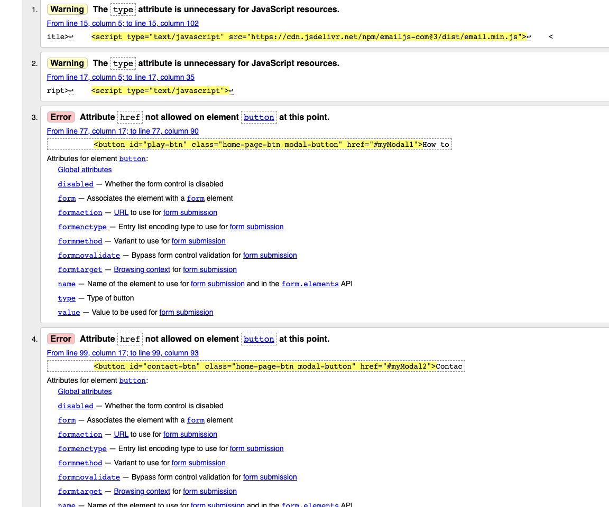
 
 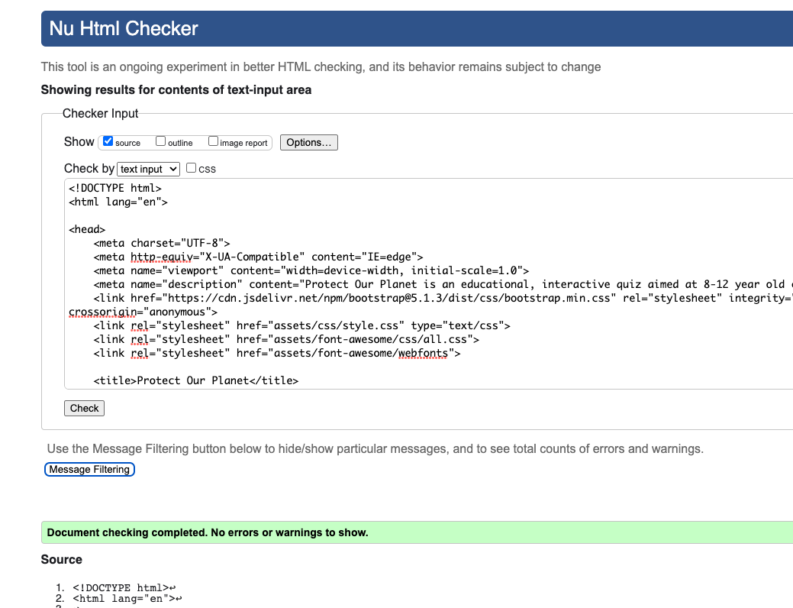

 * The [W3C CSS Validation Service](https://jigsaw.w3.org/css-validator/) was used to validate the CSS stylesheet. Initially no errors were found.

 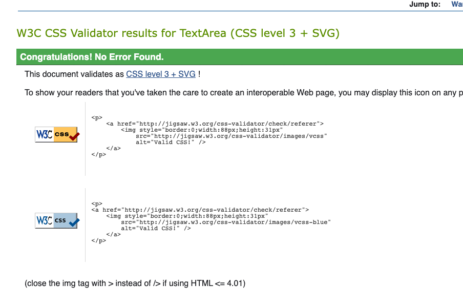

 * The [JSHint](https://jshint.com/) tool was used to check for errors in all JavaScript files. Initially there were errors regarding missing semi-colons and some variables not defined in the correct scope. With these corrected and specifying ECMAScript 6, these errors have been primarily fixed. 

 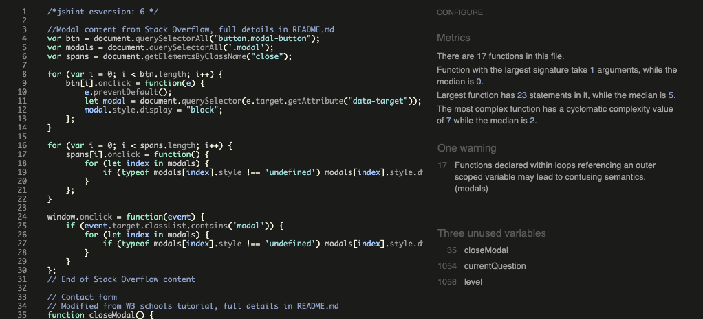
---
 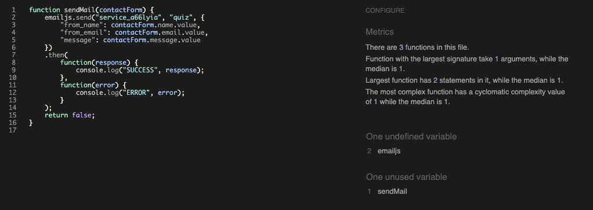

## User Stories

1. *As a first-time visior, I want to be able to understand the purpose of the site easily.* 
    * The landing page greets users with a welcome message introducing the game.

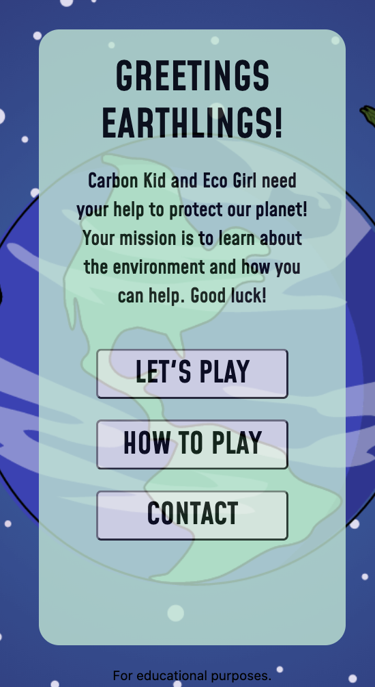

2. *As a player, I want to take part in an interactive quiz, so I can have fun.*
    * The superhero game theme and storyline adds fun to the game. It encourages players taking part to enage their imagination and be part of the quest themselves.
    * The quiz has multiple levels, which encourages players to keep playing and get the answers right. This adds excitement to the game, as players can progress through the levels.
    * When a player selects an answer it will highlight in green or red, depending on whether it is correct or not. This adds an additional visual element.
    * Throughout the game sound effects will play. When a player selects a correct or incorrect answer, at the end of a level and the end of the game. The sound effects add the the interactive aspect of the game and adds drama and excitement for the players.

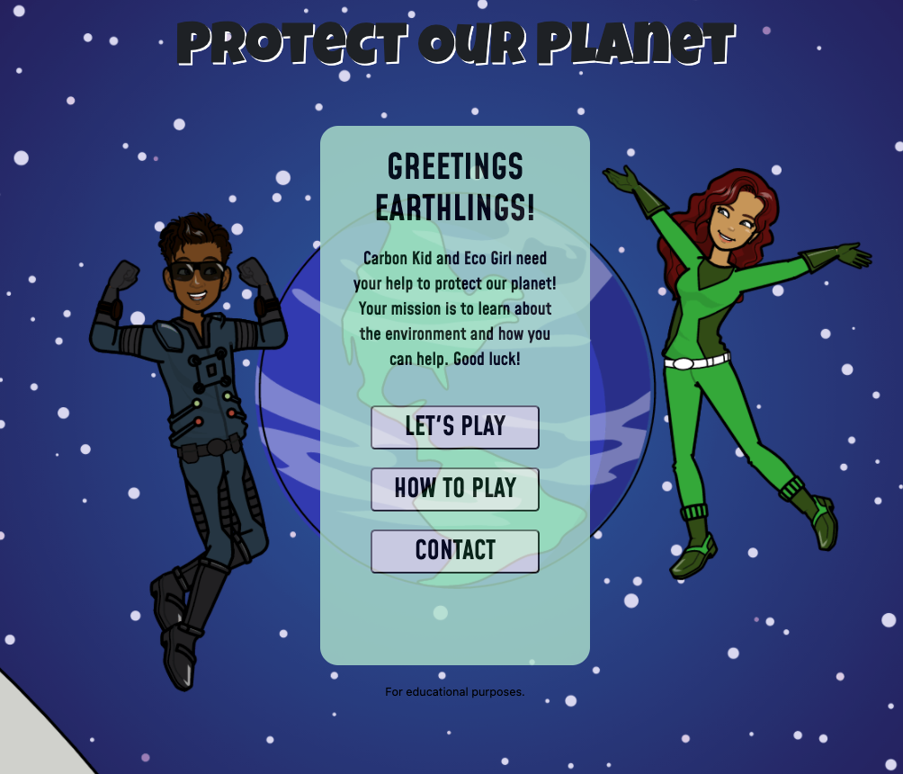

3. *As a player, I want to take part in the quiz, so I can learn about the environment.*
    * All the quiz questions are about climate change and how individuals can make changes to help.

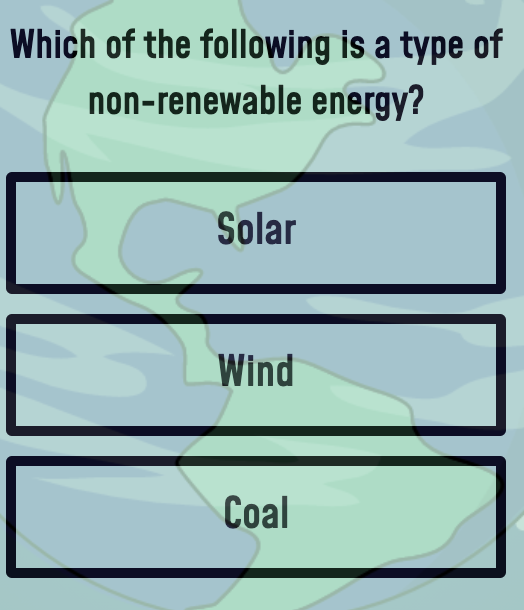

4. *As a player, I want to be able to progress through levels, so I can continue to playing and test what I know.*
    * There are three levels available for players to progress through. 
    * The levels increase in difficulty, making the game harder as players get to the next level.
    * In order to progress to the next level, players must achieve seven points or more. If players do not achieve this, they will be returned to level 1.

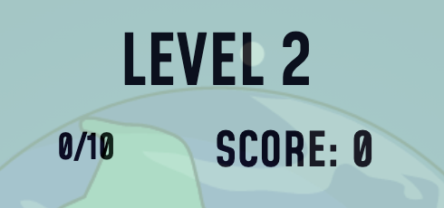

5. *As a player, I want to be able to see how many questions are left.*
    * Once a player starts a level, a question counter will be displayed in the top left hand area of the quiz container. It increases as the players move onto the next question.

6. *As a player, I want to see my score, so I can see how well I am doing and where I can improve.*
    * During each level in the top right area of the quiz container the player's score is displayed. It shows how many correct answers a player has got.

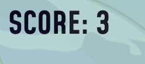

7. *As a player, I want to be able to exit the game at any point.*
    * Once a level has started, a home button displays. This allows a player to leave the game at any point.

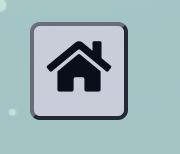

8. *As a player, I want to be able to understand the aim of the game and rules easily.*
    * On the home page, there is a "How to Play" button. This opens a modal that explains the aim of the game and the rules. 
    * The explanation and rules are simple, as this is primarily aimed at 8-12 year old children.

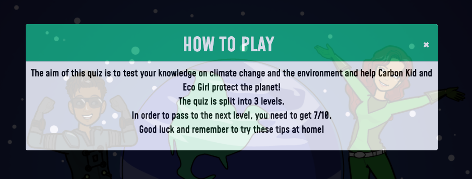

9. *As a player, I want to be able to navigate the site easily.*
    * The "Let's Play", "How to Play" and "Contact" buttons clearly indicate what each button is for. 
    * The "Home" button allows players to return to the home page at any time. 

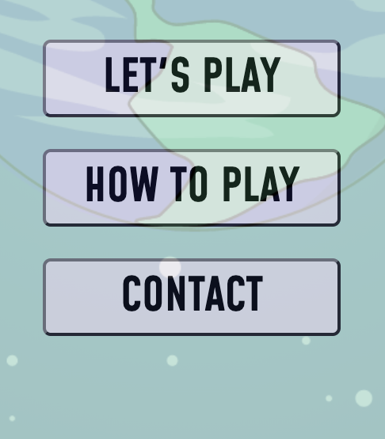

10. *As a player, I want to enjoy content on different devices.*
    * The site has been developed so users can enjoy the site on mobile, tablet, laptop and larger screens.

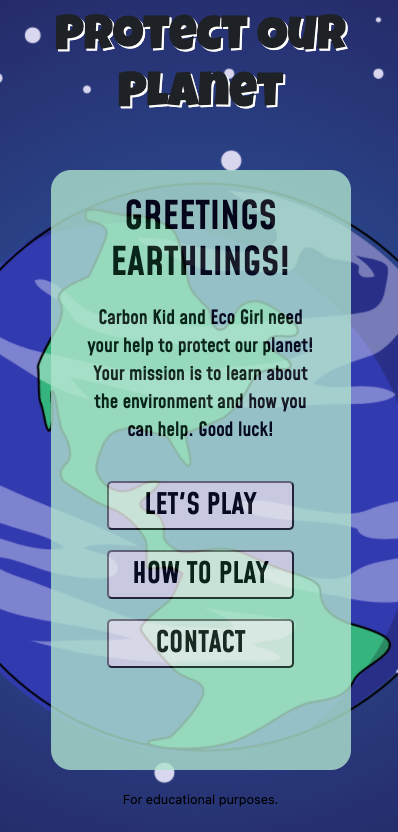

11. *As a player, I want to enjoy a vibrant and eye-catching theme and design.*
    * The graphics and superhero characters have been used to help create a superhero themed site. They are age-relevant, bold and impressive.

12. *As a parent/teacher, I want the game to teach children about the environment in a fun and accessible way, so they can understand.*
    * The question content has been used from sources and sites aimed at children. The questions have been curated so that children can understand them. 
    * A question timer or countdown has not been included. As this is an educational quiz, some of the questions may be testing for children and may need support from peers or adults. There a timer may not be best suited. This may be revised at a later stage of development. 

13. *As a parent/teacher, I want to be able to contact the site owner, so I can have my queries resolved.*
    * From the landing page, a parent/ teacher or site user can contact the site owner through a contact form. 

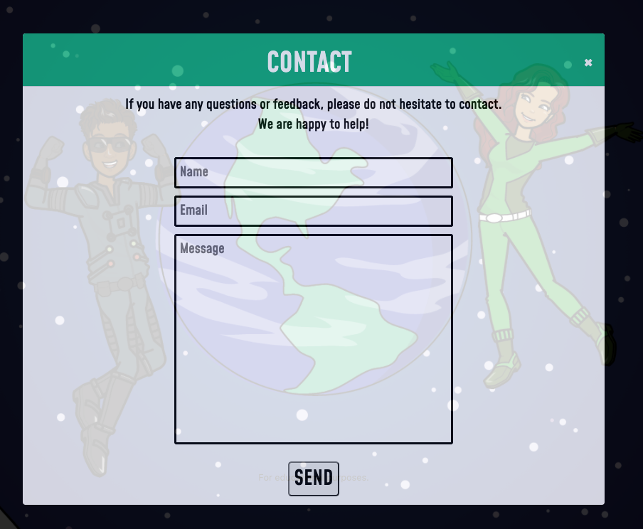

14. *As a player, I want to enjoy sound effects whilst I am playing.*
    * Sounds effects have been included to play when a player selects a correct or incorrect answer, at the end of a level and the end of the game.

15. *As a player, I want to be able to turn off sound effects if I wish.*
    * A sound button has been included to allow players to turn the sound off at any point during the game. 
    * Currently the display of the button does not change, showing whether the sound is on or off. This has been highlighted in features left to implement.

## Features

### Contact Form

The contact form has been developed so that users can fill out the form and it is sent to the site owner, using EmailJS. 

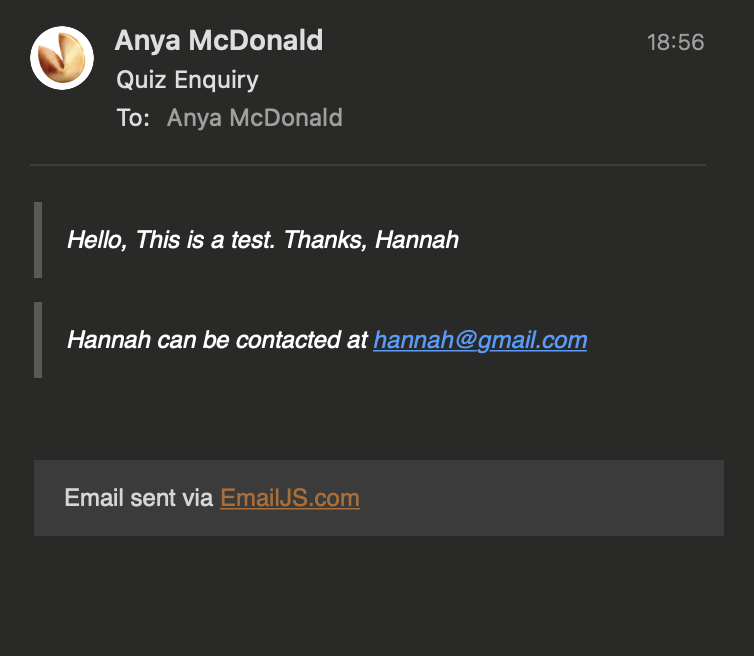

## Responsiveness

Responsiveness was tested using [Google Chrome Developer Tools](https://developer.chrome.com/docs/devtools/) and Safari Develop options.

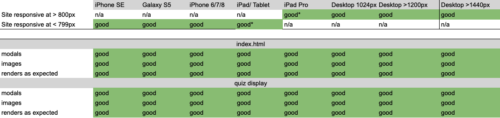

*Note: On iPad/ tablet devices, the site is responsive but there are minor layout adjustments to the quiz container depending on whether the tablet is being held vertically or horizontally.*

## Browser Compatibility

The site was developed on Google Chrome 95.0.4638.69 and counter checked on Safari 15.1 on macOS Monterey.

Using [Lamdatest](https://www.lambdatest.com/) the site's browser compatibility was checked.

A selection of browsers and versions for both Windows and macOS were tested.
- Chrome: 95, 91, 90
- Firefox: 91, 89, 88
- Safari: 15.1, 12
- Edge: 94, 91, 90

Below is some examples from the browswer compatibility tests.

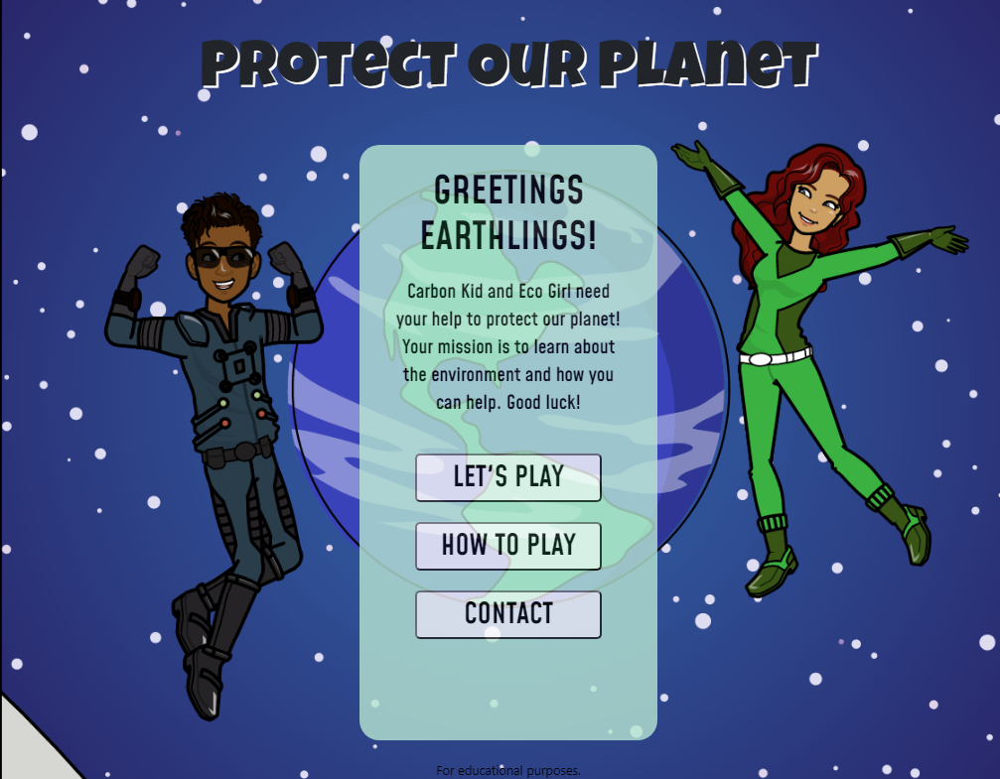
---
*This is from Windows 10 Edge 94*

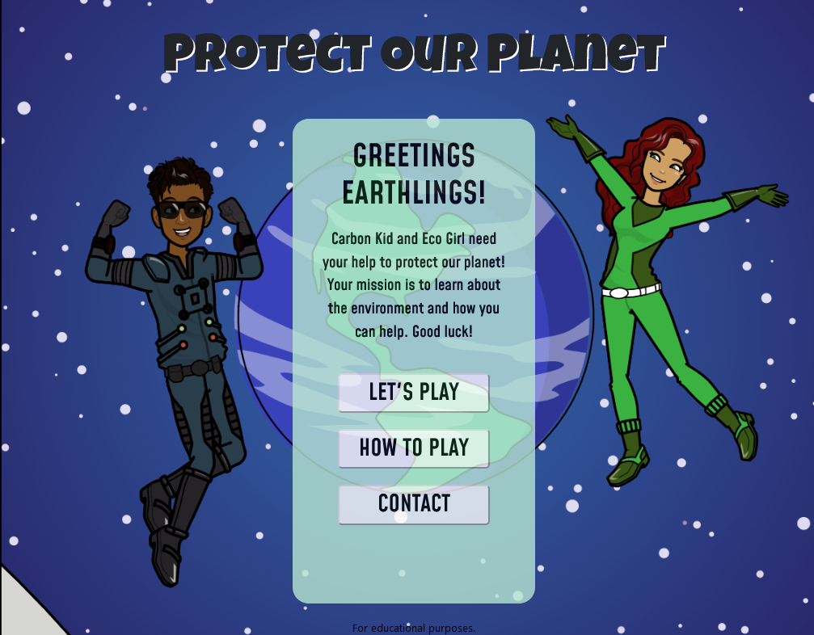
---
*This is from Windows 10 Firefox 91*

## Performance

To test the performance of the site, Google Chrome Developer Tools were used. Performance, accessibility, best practice and search engine optimisation (SEO) were tested.

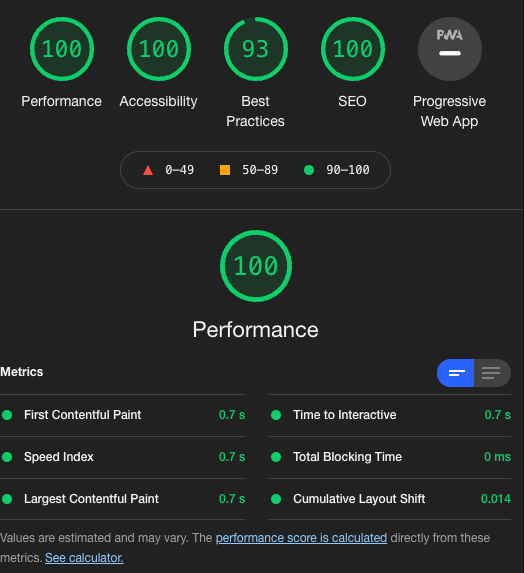

## Bugs

### Resolved
1. Initial HTML validation through W3C HTML Validation highlighted several bugs. There are as shown below.
    - The type attribute was removed from the JavaScript resources.
    - The href attribute was removed from the modal buttons. Data-target and data-toggle were applied instead. 

2. A favicon console error was displayed.
    - A link was added to the head of the HTML file to prevent a 404 favicon error.  
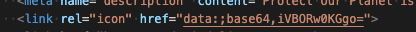

3. Moving questions arrays to JSON file. 
    - Initially using the fetch method, the questions were not displaying correctly. It was learnt that the different levels of questions needed to be able to be used seperately and not as a single array. With exploration and support, the async await function was applied. This has ensured the questions are displayed correctly and the relevant data accessed.
    - During exploration of another bug, the async await function was modified several times to confirm this was not part of the error. It was corrected and now ensures questions are displayed correctly.

4. Clearing form data after submission
    - Initially after a user submitted the form, if the page was not refreshed, the contact form would remain populated with the previous inputs. With the addition of form.reset() to the function which opens the form modal, the form now clears the data ready for a new user or new enquiry.

5. Responsiveness for iPad and tablets
    - When developing there was an issue with where the main quiz container was positioned on iPad and tablet screens. With media queries, this has been resolved and now works well on iPad and tablet screens. 

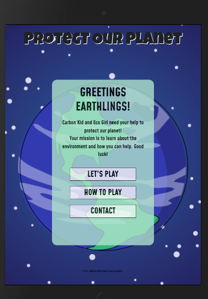

### Existing

1. Limitations with Graphics
    - The graphics were designed using Pixton, a platform that has populated styles and options. This site did not offer the option to reduce the sizes of the avatars, and as a result means that they are not displayed on smaller screens. 

2. Responsiveness for iPad Pro
    - The site has been developed to allow use across all screen sizes. Media queries have been used to ensure a good user experience. For iPad Pros the main container sits higher when held vertically. This will be explored and further developed to ensure a good user experience. 
    - The site works well on an iPad pro when helf horizontally. 

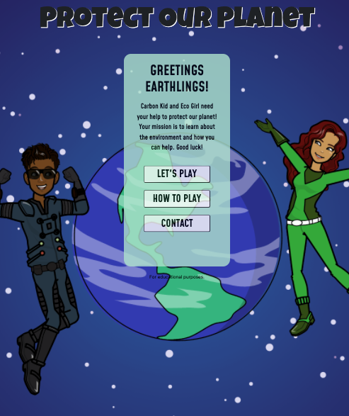. 

*This image shows the home page on an iPad Pro displayed vertically.*

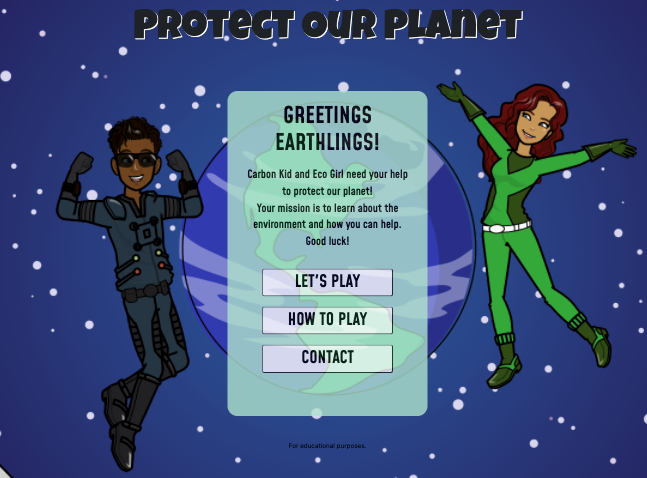. 

*This image shows the home page on an iPad Pro displayed horizontally.*

3. Sound and Home Buttons
    - When users are playing the quiz, the sound and home button move. This is due to the next question button being hidden until a user selects an answer then is displayed to allow the user to continue. With further development these buttons will remain fixed and not move.

4. Form Validation
    - Whilst developing a validateForm function was used to validate form inputs. During development a warning appeared that caused the site to repeatedly load and not move on screen. Through research and support, it was discovered that there was no click event for submit, and so it was continually trying to submit. 
    - This was resolved by adding a click event to the contact form. 
    - Following this the validateForm function then impacted the sendMail function and prevented emails being submitted to the site owner. Due to time constraints, this has been removed to ensure that the contact form can be used by a site user. This will be explored and developed further in the future to ensure correct contact form validation. The required attribute has been added to the HTML form inputs.

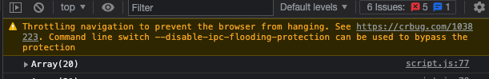

*This was the warning message that appeared*. 
