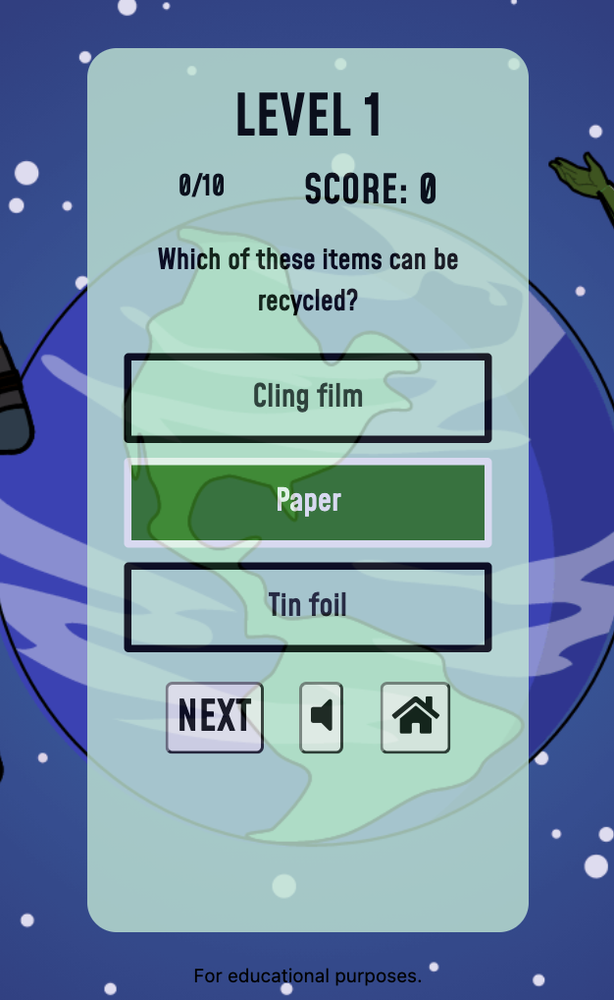

# Testing

## Code Validation
 * HTML
 * CSS
 * JS

## User Stories

1. *As a first-time visior, I want to be able to understand the purpose of the site easily.* 
    * The landing page greets users with a welcome message introducing the game.

2. *As a player, I want to take part in an interactive quiz, so I can have fun.*
    * The superhero game theme and storyline adds fun to the game. It encourages players taking part to enage their imagination and be part of the quest themselves.
    * The quiz has multiple levels, which encourages players to keep playing and get the answers right. This adds excitement to the game, as players can progress through the levels.
    * When a player selects an answer it will highlight in green or red, depending on whether it is correct or not. This adds an additional visual element.
    * Throughout the game sound effects will play. When a player selects a correct or incorrect answer, at the end of a level and the end of the game. The sound effects add the the interactive aspect of the game and adds drama and excitement for the players.

3. *As a player, I want to take part in the quiz, so I can learn about the environment.*
    * All the quiz questions are about climate change and how individuals can make changes to help.

4. *As a player, I want to be able to progress through levels, so I can continue to playing and test what I know.*
    * There are three levels available for players to progress through. 
    * The levels increase in difficulty, making the game harder as players get to the next level.
    * In order to progress to the next level, players must achieve seven points or more. If players do not achieve this, they will be returned to level 1.

5. *As a player, I want to be able to see how many questions are left.*
    * Once a player starts a level, a question counter will be displayed in the top left hand area of the quiz container. It increases as the players move onto the next question.

6. *As a player, I want to see my score, so I can see how well I am doing and where I can improve.*
    * During each level in the top right area of the quiz container the player's score is displayed. It shows how many correct answers a player has got.

7. *As a player, I want to be able to exit the game at any point.*
    * Once a level has started, a home button displays. This allows a player to leave the game at any point.

8. *As a player, I want to be able to understand the aim of the game and rules easily.*
    * On the home page, there is a "How to Play" button. This opens a modal that explains the aim of the game and the rules. 
    * The explanation and rules are simple, as this is primarily aimed at 8-12 year old children.

9. *As a player, I want to be able to navigate the site easily.*
    * The "Let's Play", "How to Play" and "Contact" buttons clearly indicate what each button is for. 
    * The "Home" button allows players to return to the home page at any time. 

10. *As a player, I want to enjoy content on different devices.*
    * The site has been developed so users can enjoy the site on mobile, tablet, laptop and larger screens.

11. *As a player, I want to enjoy a vibrant and eye-catching theme and design.*
    * The graphics and superhero characters have been used to help create a superhero themed site. They are age-relevant, bold and impressive.

12. *As a parent/teacher, I want the game to teach children about the environment in a fun and accessible way, so they can understand.*
    * The question content has been used from sources and sites aimed at children. The questions have been curated so that children can understand them. 
    * A question timer or countdown has not been included. As this is an educational quiz, some of the questions may be testing for children and may need support from peers or adults. There a timer may not be best suited. This may be revised at a later stage of development. 

13. *As a parent/teacher, I want to be able to contact the site owner, so I can have my queries resolved.*
    * From the landing page, a parent/ teacher or site user can contact the site owner through a contact form. 

## Responsiveness
 * Chrome Dev tools

## Browser Compatibility
 * Lambda test

## Performance

To test the performance of the site, Google Chrome Developer Tools were used. Performance, accessibility, best practice and search engine optimisation (SEO) were tested.

## Bugs
